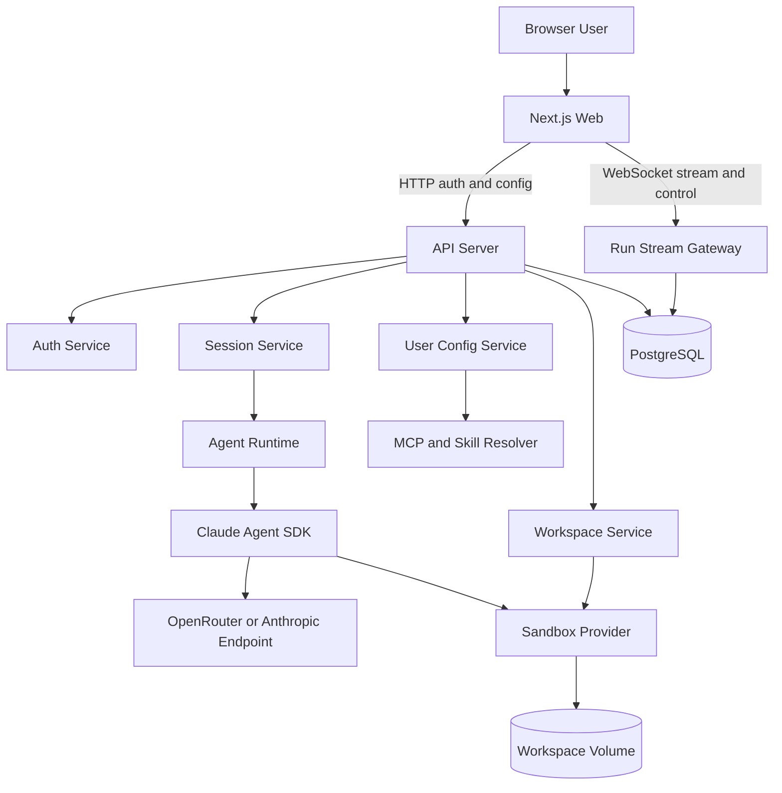

# OpenClaude 架构方案

## 1. 背景

本项目是一个面向少量白名单用户的 Claude-like Agent 产品，计划部署在单机 VM 上。前端体验参考 Claude 官网和 Claude Code 的交互方式，但产品定位不是普通 ChatBot，而是一个可以围绕每个会话 Workspace 执行文件读写、Bash、MCP、Skill、多模态输入和多轮 Agent 任务的 Web 应用。

当前项目为空项目，因此早期设计重点是确定长期稳定的技术边界：Agent Runtime、流式协议、Workspace 隔离、用户级配置隔离、单机部署形态，以及未来持续迭代时不容易推倒重来的模块划分。

## 2. 核心诉求

1. 登录可以先简化为一个管理员账号，但数据库和代码结构要按多用户预留。
2. 一期先接入 Claude 官方模型，通过 OpenRouter 作为模型路由入口；未来 DeepSeek 等模型如果能通过 OpenRouter、Claude Code Router 或其它兼容层暴露为 Claude Agent SDK 可用协议，业务逻辑不分叉。
3. 后端核心不是普通 Chat API，而是基于 Claude Agent SDK 的 AgentLoop。多轮对话依赖 SDK 的 `resume`，不手动拼接历史。
4. 前端需要实时看到文本、工具调用、工具结果、文件变化、错误和最终状态。
5. 一期就需要支持打断 Agent 执行，因此流式通道要同时支持数据流和控制消息。
6. 每个用户可配置自己的 MCP、Skill 等能力。MCP/Skill 配置可以明文保存，方便管理员调优；服务级 API key 不能写入代码或前端。
7. 每个会话或项目要有自己的 Workspace，上传文件和 Agent 产物在 Workspace 范围内组织。当前用户可信，目标是“越用越好用”，不希望每轮都冷启动全新环境并反复安装依赖。
8. 单机部署，早期用户规模约 2 人，避免引入 Redis、对象存储、复杂 worker 集群等过早复杂度。

## 3. Claude Agent SDK 实测结论

已在临时目录中用 `@anthropic-ai/claude-agent-sdk@0.3.143` 真实调用 OpenRouter，验证了以下能力。

### 3.1 OpenRouter 接入

Claude Agent SDK 可以通过环境变量路由到 OpenRouter：

```bash
ANTHROPIC_BASE_URL=https://openrouter.ai/api
ANTHROPIC_AUTH_TOKEN=$OPENROUTER_API_KEY
ANTHROPIC_API_KEY=
ANTHROPIC_DEFAULT_SONNET_MODEL=anthropic/claude-sonnet-4.5
```

实测可正常返回 SDK 事件。服务端必须只从环境变量读取 `OPENROUTER_API_KEY`，不要写入代码、文档或前端配置。此前在对话中暴露过的 key 应立即轮换。

### 3.2 流式事件形态

SDK 返回的事件比普通 token stream 更丰富，包括：

- `system init`：包含 `session_id`、`cwd`、可用工具、MCP server 状态。
- `assistant`：包含 thinking、redacted_thinking、text、tool_use 等 content block。
- `user`：工具结果会以 `tool_result` 形式回灌为 user message。
- `result`：包含运行耗时、轮数、成本、错误、权限拒绝等摘要。
- Skill 加载会产生 synthetic user message，把 Skill 内容注入上下文。

重要实测：在 OpenRouter 路由下，`result.result` 可能为空。前端文本渲染和历史落库不能依赖 `result.result`，应该从 `assistant.message.content` 的 `text` blocks 汇总。

### 3.3 Resume

第一轮捕获 `system init` 的 `session_id`，第二轮通过 `options.resume=session_id` 可以恢复上下文。多轮对话应该保存 SDK session id，而不是自己维护完整拼接后的 messages。

部署时还必须持久化 Claude Code/Agent SDK 的会话存储目录。否则服务容器重建后，数据库里保存的 `sdk_session_id` 可能无法 resume。实现上应给 API/Agent 进程配置持久化 `HOME` 或 `CLAUDE_CONFIG_DIR`，并把路径记录为 `sdk_session_storage_path`。

### 3.4 打断

`query()` 返回的 `Query` 实例支持 `close()`。实测在 Bash 长任务运行中调用 `query.close()` 可以终止当前 query，且没有残留测试中的 `sleep` 子进程。

因此一期 WebSocket 的 `stop_run` 控制消息可以映射为服务端调用对应 run 的 `query.close()`。

### 3.5 Workspace 与隔离

`cwd` 只是 Claude Code 子进程的默认工作目录，不是安全边界。实测在 workspace 内执行 Bash 可以读取 `../outside-secret.txt`。

因此：

- 目录级 Workspace 只能作为组织边界，不能视为安全沙箱。
- `allowedTools` 会自动允许工具，不适合作为安全策略随意开放。
- Bash、Read、Write、Edit 等能力需要应用层权限守卫、路径校验、命令审计；生产 MVP 不应只依赖应用层守卫，至少要使用每用户独立 UNIX uid 或长生命周期 per-user container 作为 OS 级边界。

### 3.6 Skills

Project-level Skill 可以放在：

```text
.claude/skills/{skill-name}/SKILL.md
```

并通过 SDK `skills: ["skill-name"]` 启用。Skill 文件不应放秘密，因为未启用的 Skill 只是对模型隐藏，不是文件系统安全隔离。

### 3.7 MCP

SDK 可通过 `mcpServers` 注入 stdio MCP server。连接成功后，工具会以：

```text
mcp__{serverName}__{toolName}
```

形式出现在工具列表。前端工具调用 UI 需要识别这种命名并映射回用户友好的 MCP server/tool 展示。

## 4. 推荐技术路线

采用 TypeScript 全栈：

- `Next.js`：Web UI、登录页、聊天界面、配置界面、文件面板。
- `Node.js API`：认证、Session、Run、Workspace、WebSocket、Claude Agent SDK Runtime。
- `PostgreSQL`：用户、会话、run、workspace、MCP/Skill 配置、消息摘要。
- 本地卷：workspace、上传文件、SDK 原始事件 JSONL、用户配置投影。
- `Docker Compose`：单机部署 `web`、`api`、`postgres`、`nginx/caddy`。

一期不引入独立 Chat Provider。模型切换只作为 Claude Agent SDK/OpenRouter 路由参数变化。

生产 MVP 的隔离策略调整为：本地开发可以使用纯目录 workspace；服务器部署至少使用每用户独立 UNIX uid，优先实现长生命周期 per-user dev container。这样可以保留依赖缓存和“越用越好用”的体验，同时避免 Bash 直接继承 API 进程权限。

## 5. 目标项目结构

```text
apps/
  web/                  # Next.js 前端
  api/                  # Node.js API + WebSocket + Agent Run 管理
packages/
  shared/               # 前后端共享类型
  agent-runtime/        # Claude Agent SDK 薄封装
  sandbox/              # Workspace 和执行隔离抽象
  model-registry/       # OpenRouter/Claude 模型列表与默认模型映射
infra/
  compose.yaml
  nginx/ 或 caddy/
docs/
  architecture-plan.md
```

## 6. 核心架构



## 7. 数据模型草案

### 7.1 users

- `id`
- `username`
- `password_hash`
- `role`
- `created_at`
- `updated_at`

MVP 可以只有一个管理员账号，但仍使用 users 表。

### 7.2 workspaces

- `id`
- `user_id`
- `name`
- `root_path`
- `shared_home_path`
- `unix_uid`
- `container_name`
- `created_at`
- `updated_at`

建议一个用户可以有多个 workspace。通用缓存和依赖只能放在该用户自己的 shared home，不能跨产品用户共享。服务器上应通过 owner/mode、独立 UNIX uid 或 per-user container 保证其他用户不可达。

### 7.3 sessions

- `id`
- `user_id`
- `workspace_id`
- `title`
- `sdk_session_id`
- `sdk_session_storage_path`
- `current_model`
- `created_at`
- `updated_at`

`sdk_session_id` 保存 SDK resume 所需 id；`sdk_session_storage_path` 记录该 session 对应的持久化 SDK 存储根路径，便于容器重建、迁移和排错。

### 7.4 runs

- `id`
- `session_id`
- `user_id`
- `workspace_id`
- `status`
- `model`
- `input_json`
- `started_at`
- `finished_at`
- `error`
- `cost_usd`
- `num_turns`
- `stop_reason`

`input_json` 用于支持文本、附件引用、多模态输入和未来参数扩展。运行中的 run 在 API 进程内维护 `Query` 实例，用于 stop；API 启动时需要把未完成 run 标记为 `interrupted_by_restart`，避免 UI 永久 loading。

### 7.5 run_messages

- `id`
- `run_id`
- `role`
- `content`
- `sdk_message_uuid`
- `created_at`

只保存 UI 恢复所需摘要，不把所有 SDK 原始事件塞入数据库。

### 7.6 run_attachments

- `id`
- `run_id`
- `workspace_file_path`
- `mime_type`
- `size_bytes`
- `source`
- `created_at`

附件和多模态输入通过该表关联 run。完整 SDK 原始事件不默认进入数据库，写入 JSONL 文件；关键事件摘要合并到 `run_messages` 或 run 状态字段。

### 7.7 user_mcp_servers

- `id`
- `user_id`
- `name`
- `config_public_json`
- `secrets_json`
- `enabled`
- `created_at`
- `updated_at`

`config_public_json` 可直接给管理员查看和调优；`secrets_json` 存放第三方 API key、token 等敏感字段，MVP 可以明文但必须字段分离、默认不返回前端，后续可无痛升级为加密存储。OpenRouter 服务级 key 仍只放服务端环境变量。

### 7.8 user_skills

- `id`
- `user_id`
- `name`
- `description`
- `content`
- `enabled`
- `created_at`
- `updated_at`

运行前投影到 workspace 的 `.claude/skills/{name}/SKILL.md`，或未来改为 plugin/SDK 配置方式。

## 8. Workspace 与隔离策略

当前用户可信，但 Bash 能力天然高风险。最终路线是“持久化用户环境 + OS 级用户边界 + workspace 目录”：

```text
/srv/openclaude/
  users/
    {userId}/
      home/              # 用户级缓存、通用依赖、工具安装结果
      claude/            # 持久化 Claude Agent SDK session/config
      workspaces/
        {workspaceId}/   # 项目或会话文件
          .claude/
          uploads/
          files/
```

优点：

- 启动快。
- 依赖和缓存可复用。
- 符合“越用越好用”的体验。
- 适合两位可信用户的单机部署。

风险：

- 纯目录模式不是强安全隔离，只允许本地开发或临时调试。
- 如果 Bash 继承 API 进程权限，就可能访问宿主机可读路径、服务端密钥或另一个用户文件。
- 需要应用层权限守卫和审计。

一期必须实现：

- 服务器部署采用每用户独立 UNIX uid，或优先采用长生命周期 per-user dev container。容器挂载该用户的 `home/`、`claude/` 和 `workspaces/`，不挂载项目外敏感路径。
- 运行前固定 `cwd` 到 workspace root。
- Bash 当前走 SDK `bypassPermissions`，不再做 OpenClaude 自定义命令拦截；后续安全边界应优先落到独立 UNIX uid / container / 文件系统隔离。
- 文件工具路径必须 normalize 后校验是否在允许目录内。
- 记录 Bash 命令、工具输入、工具结果摘要。
- 限制单 run wall clock timeout、Bash 单命令 timeout、per-user 并发 run、per-workspace 磁盘配额。
- API 进程重启时，将所有 `running` run 标记为 `interrupted_by_restart`。

未来增强：

- gVisor/Firecracker 等更强隔离。
- Nix/Devbox 用于环境复现，但不作为安全沙箱。

## 9. 流式与控制协议

一期直接使用 WebSocket，不使用 SSE。

原因：

- 需要打断 Agent。
- 后续可能支持用户审批、继续、暂停、中途补充输入。
- WebSocket 可同时承载 SDK event stream 和控制消息，避免后续协议迁移。

Run 创建建议使用 HTTP，流式订阅和控制使用 WebSocket：

- `POST /api/runs`：创建 run，返回 `runId`。
- `GET /api/runs/{runId}`：恢复 run 状态和摘要。
- WebSocket `subscribe_run`：订阅指定 run 的 SDK event stream。
- WebSocket `stop_run` 或 `DELETE /api/runs/{runId}`：停止 run。

这样可以避免 WebSocket 断线导致 start 请求语义不清，也方便 HTTP 层做认证、幂等和审计。

服务端到前端事件采用最小 envelope：

```ts
type AgentStreamEnvelope = {
  version: 1;
  runId: string;
  sequence: number;
  timestamp: string;
  provider: "openrouter" | "anthropic";
  sdkEvent: unknown;
  uiHints?: {
    kind?: "text" | "tool" | "result" | "error" | "status";
  };
};
```

前端到服务端控制消息：

```ts
type ClientControlMessage =
  | { type: "subscribe_run"; runId: string; afterSequence?: number }
  | { type: "stop_run"; runId: string }
  | { type: "ack"; runId: string; sequence: number };
```

落库策略：

- 运行中直接推 WebSocket。
- 异步保存关键事件和最终摘要。
- 完整原始 SDK 事件可写 JSONL 文件。
- 页面刷新后从数据库恢复已完成 run；运行中的 run 先按单机内存 registry 处理。
- OpenRouter 与 Anthropic 直连的差异在 `agent-runtime` 内消化，前端只消费 envelope 和少量稳定 `uiHints`。

## 10. MCP 与 Skill 策略

### MCP

用户配置以数据库为 source of truth，运行前解析为 SDK `mcpServers`：

```ts
mcpServers: {
  playwright: {
    command: "npx",
    args: ["@playwright/mcp@latest"]
  }
}
```

需要记录 MCP server 连接状态，并在前端展示 `mcp__server__tool` 工具调用。MCP server 不应每个 run 都冷启动；优先按用户/workspace 维护长生命周期 MCP 进程或连接池，run 启动时复用，连接失败通过工具列表事件异步反馈给前端。

### Skill

Skill 以数据库为 source of truth。MVP 使用项目级文件投影：

```text
{workspaceRoot}/.claude/skills/{skillName}/SKILL.md
```

运行时通过：

```ts
skills: ["skillName"]
```

启用指定 Skill。每次 run 启动前由数据库覆盖写入 workspace `.claude/skills/`，该目录视为生成物；用户手动修改投影文件不反向同步回数据库。Skill 不是秘密存储位置。

## 11. 部署方案

单机 Docker Compose：

- `web`：Next.js
- `api`：Node.js API + WebSocket + Claude Agent SDK
- `postgres`
- `nginx` 或 `caddy`

暂不引入：

- Redis
- 对象存储
- 独立 agent-worker
- 多机调度

推荐路径：

```text
/srv/openclaude/
  data/postgres/
  data/uploads/
  users/
  logs/
  run-events/
```

API/Agent 服务必须挂载持久化目录：

- `/srv/openclaude/users/{userId}/home`：依赖、缓存、工具安装结果。
- `/srv/openclaude/users/{userId}/claude`：Claude Agent SDK/Claude Code session 与配置。
- `/srv/openclaude/users/{userId}/workspaces`：用户 workspace。

## 12. MVP 阶段

### Phase 1

- TypeScript monorepo 骨架。
- 管理员登录。
- Session 列表和聊天界面。
- Claude Agent SDK + OpenRouter 单模型运行。
- OpenRouter/Anthropic 兼容差异 fixture：文本、工具调用、工具结果、Skill、MCP、resume、错误、成本字段。
- WebSocket stream。
- `POST /api/runs` 创建 run，WebSocket 订阅 run，`stop_run` 调 `query.close()`。
- 持久化 workspace、SDK session 存储和 JSONL 事件。
- 服务器部署的最小 OS 级隔离：每用户独立 UNIX uid 或 per-user dev container。
- per-run timeout、Bash timeout、per-user 并发限制、workspace 磁盘软配额。

### Phase 2

- 文件上传、预览、删除。
- 工具调用 UI。
- SDK resume 多轮会话。
- run 历史恢复。
- 错误和中断状态展示。

### Phase 3

- 用户级 MCP 配置。
- 用户级 Skill 管理。
- 管理员调优界面。
- SDK 原始事件 JSONL 归档。
- Bash 审计和更严格权限守卫。
- MCP 长生命周期连接池。

### Phase 4

- OpenRouter 模型列表和模型切换。
- Opus/Sonnet/Haiku 默认映射。
- 成本统计。
- 多模态文件输入优化。

### Phase 5

- 单机部署加固。
- 备份和恢复。
- 监控告警。
- gVisor/Firecracker 等更强沙箱。
- 邀请制多用户。

## 13. 当前关键风险

1. Workspace 目录隔离不是安全隔离；服务器部署至少需要每用户独立 UNIX uid 或 per-user container。
2. SDK 事件结构复杂，前端不能只按普通 Chat token stream 设计。
3. OpenRouter 兼容层可能带来模型 ID、错误格式、成本统计、`result.result`、thinking block 等差异，需要 fixture 矩阵持续验证，并把 provider 错误原样暴露给管理员。
4. `allowedTools` 和 `canUseTool` 的交互需要谨慎验证，不能把自动允许当成安全策略。
5. 单进程内保存运行中 `Query` 实例适合单机 MVP，但进程重启会丢失正在运行的 run；启动时必须把 running run 改为 interrupted。
6. MCP 配置可能包含第三方密钥，不能和普通可展示配置混在同一个前端可见字段里。
7. 同一 API 进程并发多个 SDK `query()` 会派生多个 Claude Code 子进程，需要在实施早期做最小负载测试。

## 14. 下一步实施建议

1. 先搭建 monorepo、数据库 schema、`POST /api/runs` 和 WebSocket run 订阅。
2. 同步实现 SDK session 持久化、run 重启中断语义、timeout、并发限制和 JSONL 事件归档。
3. 把 SDK 原始事件完整透传到前端，先做通用事件查看器，再逐步美化。
4. 实现服务器部署的最小 OS 级隔离方案，并保留本地开发的纯目录模式。
5. 实现 Workspace 路径守卫、Bash 审计、OpenRouter 兼容 fixture。
6. 再做文件上传、MCP/Skill 配置、模型切换和部署脚本。

## 15. Claude Code 评审后吸收的调整

已调用本机 `claude` CLI 使用 Claude Code 对本方案进行评审。评审认为整体方向可行，但要求把以下内容前置：

- 隔离不能放到后期，生产 MVP 至少要有每用户 OS 级边界。
- SDK session 存储路径必须持久化，否则 `resume` 只保存数据库 id 不够。
- Run 创建应走 HTTP，WebSocket 负责订阅和控制，降低断线语义复杂度。
- OpenRouter 兼容差异需要 fixture 矩阵，不只记录一次手工探针结论。
- MCP/Skill 要指定数据库为 source of truth，文件投影只是生成物。
- MCP secrets 应和公开配置分离，即使 MVP 暂不加密，也不能默认返回前端。
- 超时、并发、磁盘配额、进程重启中断状态都应进入 Phase 1。

本文档已按上述反馈调整 Phase 1 范围、数据模型、流式协议、隔离策略和风险列表。
